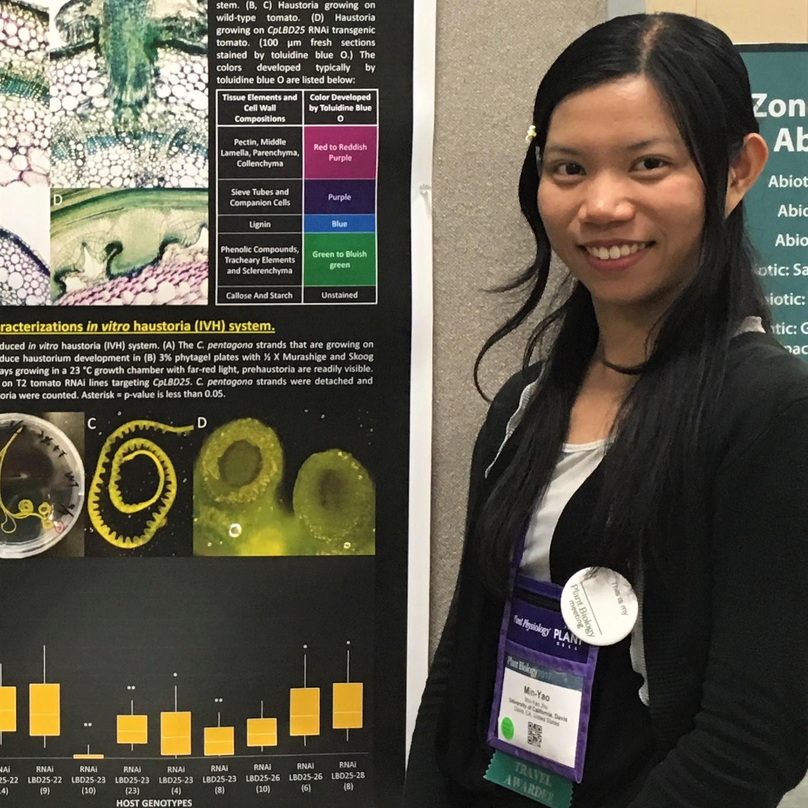

# Min-Yao's personal website and CV
Welcome! This is Min-Yao's personal website!

## Min-Yao's Curriculum Vitae   

## Table of contents

1. [Bio](#Bio)
2. [Education](#Education)
3. [Publications](#Publications)
4. [Experiences](#Experiences)
5. [Awards & Honors](#Awards)
6. [Outreach & volunteering](#Outreach_volunteering)

## Bio 

# Min-Yao Jhu

I am a sixth-year Ph.D. candidate in the Plant Biology Graduate Program at UC Davis. I have been doing research in the plant biology field for 10 years. My research interests are plant-parasite interactions, plant biotic stress, and plant-fungal or plant-bacterial symbiosis research. I am currently working in Sinha Lab and I am focusing on parasitic plant research, especially _Cuscuta_ _campestris_. In my current research, I use bioinformatics, genetics, molecular biology, and histology techniques to study haustorium development and the interaction between parasitic plants and tomatoes.

### Contact info

[minjhu@ucdavis.edu](mailto:minjhu@ucdavis.edu)

[LinkedIn](www.linkedin.com/in/min-yao-jhu)

[UCD website](https://cbsapps.ucdavis.edu/GradStudents/Student/View/10632)

## Education 

* Ph.D. in Plant Biology    
University of California, Davis, expected summer 2021  

* Master’s Degree in Plant Biology  
National Taiwan University 2014

* Bachelor’s Degree in Life Sciences  
National Cheng Kung University 2012
    

## Publications 

**Jhu, M.-Y.**, Ichihashi, Y., Farhi, M., Wong, C., Sinha, N.R. (2021). CcLBD25 functions as a key regulator of haustorium development in Cuscuta campestris. bioRxiv. doi: [https://doi.org/10.1101/2021.01.04.425251](https://doi.org/10.1101/2021.01.04.425251)

**Jhu, M.Y.**, Farhi, M., Wang, L., Philbrook, R.N., Belcher, M.S., Nakayama, H., Zumstein, K.S., Rowland, S.D., Ron, M., Shih, P.M., Sinha, N.R. (2019). Lignin-based resistance to Cuscuta campestris in tomato. bioRxiv 706861; doi: [https://doi.org/10.1101/706861](https://doi.org/10.1101/706861)

Kuo, Y.W., Lin, J.S., Li, Y.C., **Jhu, M.Y.**, King, Y.C., and Jeng, S.T. (2018). MicroR408 regulates defense response in sweet potato upon wounding. Journal of Experimental Botany, ery381-ery381. doi: [https://doi.org/10.1093/jxb/ery381](https://doi.org/10.1093/jxb/ery381)

**Jhu, M.Y.**, Chang, Y.H., Lin, B.J., Chen, H.Y., and Yang, H.C. (2013). Genetic Dissection of Diverse Disease Prevalence and Drug Response in Global Human Populations Using Ancestry Informative Markers. Proceedings of IASC satelllite conference for the 59th ISI WSC & the 8th conference of IASC-ARS.[conference paper PDF](https://www.researchgate.net/publication/262487156_Genetic_Dissection_of_Diverse_Disease_Prevalence_and_Drug_Response_in_Global_Human_Populations_Using_Ancestry_Informative_Markers)

## Experiences 

### Research experiences

* Graduate student researcher, Sinha Lab, Department of Plant Biology, UC Davis  

> *Sep 2015 - present*

> Advisor: Dr. Neelima Sinha

> Research Topic 1: CcLBD25 functions as a key regulator of haustorium development in Cuscuta campestris

> Research Topic 2: Lignin-based resistance to Cuscuta campestris in tomato

* Research Assistant, Li Lab, Biodiversity Research Center, Academia Sinica (Taipei, Taiwan)

> *Aug 2014 - Jul 2015*

> Advisor: Dr. Wen-Hsiung Li

> Research Topic: The regulatory mechanisms of Kranz anatomy development in C4 plants.

* Graduate student researcher, Jeng Lab, Institute of Plant Biology, National Taiwan University

> *Jul 2012 - Jul 2014*

> Advisor: Dr. Shih-Tong Jeng

> Research Topic: Identification and functional characterization of wounding-responsive miRNAs in sweet potato (Ipomoea batatas cv. Tainung 57).

* Summer Research Intern, Lucas Lab, Department of Plant Biology, UC Davis  

> *Jul 2013 - Sep 2013*

> Advisor: Dr. William J. Lucas

> Global Research Experience in Advanced Technologies (GREAT) summer research program 2013

> Research Topic: How Do Plants Know? How do plants signal between their organs? A road for long-distance miRNA signaling through the phloem.

* Undergraduate Student Researcher, Liao Lab, Department of Life Sciences, National Cheng Kung University

> *Dec 2009 - Jun 2012*

> Advisor: Dr. Gwo-Ing Liao; Co-advisor: Dr. Song-Bin Chang

> Research Topic: Distribution and microstructure and chromosome ploidy in cecidomyiid galls on leaves of Litsea acuminata (Lauraceae) in Taiwan.

* Summer Research Intern, Fang Lab, The Biotechnology Center in Southern Taiwan, Academia Sinica

> *Jul 2011 - Sep 2011*

> Advisor: Dr. Su-Chiung Fang

> Research Topic: Defects in a Putative Sulfate Transporter and Cell Cycle Control in Chlamydomonas reinhardtii.

* Summer Research Intern, Cheng Lab, Institute of Plant and Microbial Biology

> *Jul 2010 - Sep 2010*

> Advisor: Dr. Wan-Hsing Cheng

> Research Topic: Identification of Drought Tolerance Determinants by a Genetic Screening at Genomic Scale.

### Teaching experiences

* Teaching assistant, College of Biological Sciences, UC Davis  

> *Jan 2021 - present*

> BIS 015L, Introduction to Data Science for Biologists (R programming), 1 quarter, 2 units, 2 lab sections and held four sessions of office hours per week. (Remote teaching via Zoom)

* Teaching assistant, Department of Plant Biology, UC Davis

> *Sep 2020 – Dec 2020*

> PLB111 Plant Physiology, 1 quarter, 3 units.
> PLB111D Plant Physiology Discussion, 1 quarter, 1 unit per section, leading 2 discussion sections and 1 office hours per week. (Remote teaching via Zoom)

* Teaching assistant, College of Biological Sciences, UC Davis

> *Aug 2020 – Sep 2020*

> BIS2C Introductory Biology, 1 quarter, 5 units, leading 2 lab sections (3 hours per section) and held two sessions of office hours per week. (Remote teaching for 2020 Summer II via Zoom)

* Teaching assistant, Department of Plant Biology, UC Davis

> *Mar 2020 – Jun 2020*

>PLB112 Plant Growth and Development, 1 quarter, 3 units. (Remote teaching)
>PLB112D Plant Growth and Development Discussion, 1 quarter, 1 unit per section, leading 4 discussion sections. (Remote teaching)

* Teaching assistant, College of Biological Sciences, UC Davis

> *Jan 2020 – Mar 2020*

> BIS2C Introductory Biology, 1 quarter, 5 units, leading 2 lab sections (3 hours per section) and one office hours per week.

* Teaching assistant, Department of Plant Biology, UC Davis

> *Sep 2019 – Dec 2019*

> PLB111 Plant Physiology, 1 quarter, 3 units.
> PLB111D Plant Physiology Discussion, 1 quarter, 1 unit per section, leading 3 discussion sections and 2 office hours per week.

* Teaching assistant, Department of Plant Biology, UC Davis

> *Mar 2019 – Jun 2019*

> PLB112 Plant Growth and Development, 1 quarter, 3 units.
> PLB112D Plant Growth and Development Discussion, 1 quarter, 1 unit per section, leading 4 discussion sections per week.

* Teaching assistant, College of Biological Sciences, UC Davis

> *Jan 2019 – Mar 2019*

> BIS2C Introductory Biology, 1 quarter, 5 units, leading 2 lab sections (3 hours per section) and one office hours per week.

* Teaching assistant, Department of Plant Biology, UC Davis

> *Sep 2018 – Dec 2018*

> PLB111 Plant Physiology, 1 quarter, 3 units.
> PLB111D Plant Physiology Discussion, 1 quarter, 1 unit per section, leading 2 discussion sections and 2 office hours per week.

## Awards & Honors 

* 2020	Graduate Student Association's Fall 2020 Travel Award

* 2020	Selected concurrent session Rapid Fire speaker at Plant Biology 2020

* 2020	Loomis, Robert S. and Lois Ann Graduate Award in Agronomy

* 2020	UCD Graduate Research Award for academic year 2020-2021

* 2019	UC Davis Plant Biology Colloquium Best Presentation Award

* 2019	Selected speaker at the 15th World Congress on Parasitic Plants (WCPP)

* 2019	Selected concurrent session speaker at Plant Biology 2019

* 2019	Katherine Esau Summer Graduate Fellowship

* 2018	Pitch Your Science Bronze Award at Plant Biology 2018

* 2018	UC Davis Graduate Student Travel Award

* 2018	Elsie Taylor Stocking Memorial Fellowship 

* 2018	American Society of Plant Biologists Travel Award

* 2017	UC Davis Plant Biology Retreat Poster Award

* 2017	UC Davis Plant Biology Colloquium Best Presentation Award

* 2017	American Society of Plant Biologists Travel Award

* 2016	UC Davis Plant Biology Retreat Poster Award

* 2016	Taiwan Government Scholarship to Study Abroad (GSSA)

* 2016	Yen Chuang Taiwan Fellowship

* 2014	Taiwan Society of Plant Biologist Annual Conference Thesis Presentation Competition, First Prize

* 2014	Taiwan Society of Plant Biologist Annual Conference Poster Competition, Excellence Award

* 2014	National Taiwan University College of Life Science Poster Competition, Excellence Award

* 2013	Enci Social Welfare Foundation Elite Scholarship 

* 2013	Outstanding Research Performance Award 

* 2013, 2012	National Taiwan University Scholarship for Academic Diligence 

* 2012, 2011, 2010	National Cheng Kung University Outstanding Student Award 

## Outreach & volunteering 

* 2020-present	Reviewer for New Phytologist
* 2017-present	R and python club member

> This is a programming learning group consisting of graduate students, postdocs, and faculty participants. All members are required to contribute to the weekly discussions. I also volunteered and led the group discussion several times. Topics included programming Raspberry Pi devices and advanced topics covered in: 

> 1.	Statistical Rethinking: A Bayesian Course with Examples in R and STAN by Richard McElreath.

> 2.	Python for Data Analysis: Data Wrangling with Pandas, NumPy, and IPython (2nd Edition) by Wes McKinney.

> 3.	An introduction to statistical learning: with applications in R by Gareth James, Daniela Witten, Trevor Hastie, Robert Tibshirani.

* 2017-present	Mentor for Undergraduate and Graduate Researchers

> I taught and trained several undergraduate students and graduate students in the PBGG rotation program in Sinha lab in molecular biology and histology techniques. I helped my undergraduate trainees develop skills in scientific literature reading and critique. 

* 2019	Seminar Host, UC Davis Plant Biology Graduate Group.

> 1.	Organized schedules and invited and hosted Professor Shelley Lumba from University of Toronto as our PBGG seminar speaker on 10/04/2019.

> 2.	Organized schedules and Invited and hosted Professor Michael Axtell from Pennsylvania State University as our PBGG seminar speaker on 10/18/2019.

* 2019-2020	Seminar Committee, UC Davis Plant Biology Graduate Student Association.

> 1.	Solicited suggestions from the PBGG students for speakers to invite for the Friday Plant Biology Graduate Seminar.

> 2.	Worked with the faculty seminar organizer to schedule and organize the seminar series.

### Science Outreach: Create a video for the AAAS Dance Your Ph.D. contest

> An annual contest challenging scientists explain their Ph.D. research by dance.

> Title: Lignin-based resistance to parasitic plants in tomato.

> Contest category: Biology.

[Watch Dance Your Ph.D. video](https://youtu.be/smUX3iAKrN0)